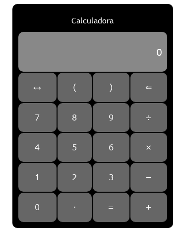

# Calculadora

Calculadora simples desenvolvida usando as linguagens básicas da web: HTML, CSS e Javascript

## Recursos

- Quatro operações básicas
- Uso de parenteses e ponto
- Fácil de usar
- Design intuitivo

## Imagem



# Instalação

```sh
git clone https://github.com/DanielVitorSM/calculadora
firefox index.html
```
Ou use o navegador de sua prefeência

## Licença

MIT

**Software Livre**
